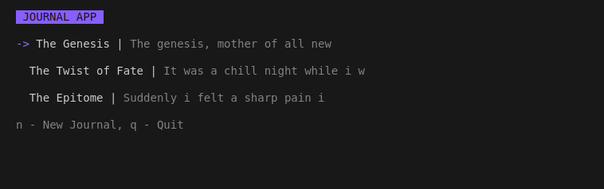

## Journal Application 🖼️

Mini application of a journal application built using go

### Features 🔌
- Authentication
- Create Journal 
- View Journal 

All listed features include test which can be found in `./test/` folder
<br /> to run all the test run, first navigate to the root folder and the run

```bash
go test -v ./test/
```
In order to run the application you first have to install all the necessary packages <br /> this can be easily done using

```bash
go install
```
After a successfully installation of all the necessary libraries, you can then run the <br /> application using

```bash
go run .
```

#### Happy Coding 😊
